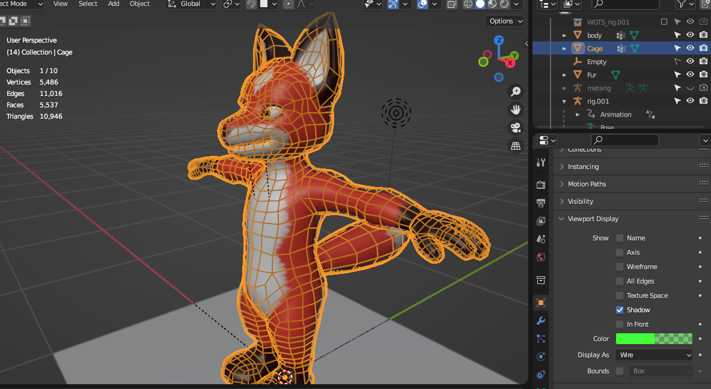

# Using the Hair Cage Geometry nodes

The geometry nodes implement a hair cage technique which simulates growing hair from your base mesh to a cage surrounding the model.  The setup can be a little intricate.

I've also created this video explaining the setup process:

## Installation

* Create a new file folder on your system that you will use for storing the Blender assets.
* Download the furTools-hairCage.blend, furTuft_256x256.png and suzanne-furry-albedo.png and put them in the folder you created.
* Open Blender's Preferences window (select Edit > Preferences from the main toolbar) and select the File Paths tab.
* Under the Asset Libraries section, click the button with the + symbol.  Browse to the directory where you downloaded the files, select it and click Add Asset Library
* Change the name of the library to Fur Tools.  The assets will now listed under that name in Blender's Asset Library.

## Preparing your meshes and importing the assets

* Start by creating a Plane mesh in Blender.  This mesh is going to be modified to become the fur you eventually export.  Rename your object to Fur.  (Other meshes will work for this step too, since the vertices are going to be completely replaced by ones generated by the geometry nodes).
* Duplicate your base mesh.  
    * Rename the duplicate to Cage.  
    * Enter Edit mode.
        * Select all the vertices in the mesh and press Alt-S to scale along the normals.  
        * Move your mouse slightly to make the Cage mesh slightly larger than the original.
    * In the properties editor, go into the Object Properties tab and go to the Viewport Display section.  Under Display As, select Wire.  Now your cage will appear as a wireframe object surrounding your base object.

    
* Switch to the geometry nodes tab.
    * Click on the New button to create an empty Geometry Nodes network
* Open an Asset Browser window.  (If you have not installed the assets using the assets yet, you will need to do that first).  
    * Navigate to the Fur Tools section.  
    * Drag and drop the furShader node onto your mesh.
    * Drag and drop the FurCardsWithCage node into the Geometry Nodes work area

    * From the dropdown in the work area, select the FurCardsWithCage option to replace your geometry node network with the FurCardsWithCage network

    
## Setting up the Geometry Node modifier
    
In the Properties panel and click on the Modifiers tab.  You're going to need to do some setup to link up the network with your meshes and the shader

* Set Body Mesh to the name of the body the fur is sprouting from.
* Set Cage mesh to the cage mesh you created that the fur is travelling to.
* Set Cage UV map to the name of the UV map that the cage uses.  Most of the time this will be "UVMap", since that is the uv map name that Blender assigns by default and it will still be that unless you changed it.
* Set Fur Color to the image that is used by the base mesh for its albedo color.  This texture will be sampled to determine the fur color.
* Set material to the fur shader.  (Which will be named "furShader" unless you changed it)
* You will also need to set some names under output attributes, since the fur shader depends on these to get data from the geometry shader.
    * Set furColor to the text "furColor".
    * Set furUv to the text "furUv".

## Adjusting the fur

At this point, you should be able to see fur sprouting from the mesh.  If you select the cage and go into edit mode, you can change the length and direction of the fur by clicking and dragging the control points of the cage.

There are other attributes which can use used to change the appearance of the fur:
* Card Width - the width of a single hair card
* Density - the hair distribution density
* Density Mask - You can optionally create a vertex group to control which parts of the mesh do not sprout hair.  You can use this to remove from places such as around the eyes or hands.
* Hair Tilt Randomness - Adds a random rotation to each hair card.  More rotaton results in a clumpier look.
* Fur Bend Amount - Makes the fur blend in an arc
* Fur Card Facets - The number of faces to have for each hair card
* Cutoff Length - When fur strand starts from a spot too close to a boundary on a UV map, it can cause errors with some fur stands being made far too long.  This parameter gets around that by discarding any hairs that are longer than this length.

## Exporting to a game engine

Finally, when you're you're happy with your fur, there are a few things you need to do to export it.  Since many exporters in Blender don't support geometry nodes well yet, we need to 'bake' our changes to an export mesh.
* First, I'd recommend making a duplicate of your fur mesh.  Name it FurExport (You don't have to do this step, but if you want to go back and make changes later, you can't do it with the baked mesh)
* In object mode, right click and select Convert To > Mesh

* In Blender 3.4, you will need to so some extra work to export the UVs correctly
    * Select your FurExport mesh and click on the Object Data Properties tab in the properties window.
    * Scroll down to the Attributes window
    * Scroll down to find the entry named furUv
    * Click the button on the right side with the downward pointing arrow.  Click on Convert Attribute
    * Change Mode to UV Map and click OK

At this point, your mesh should be ready to export.
